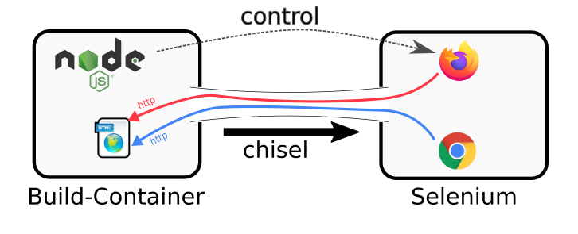

# chisel-tunnel

[](https://npmjs.com/package/chisel-tunnel) [](https://github.com/nknapp/node-chisel-tunnel/actions?query=workflow%3A%22Node.js+CI%22) [](https://www.paypal.com/cgi-bin/webscr?cmd=_s-xclick&hosted_button_id=GB656ZSAEQEXN&source=url) [](https://liberapay.com/nils.knappmeier/donate)

> Download releases of jpillora/chisel, a tool to create tcp-tunnels.

[Chisel](https://github.com/jpillora/chisel) is a software written in Go that starts TCP-tunnels. It is a single binary that can be downloaded and started.

- As a server, it will listen on a port for incoming connections.
- As a client, it will connect to a chisel server and open a tunnel, similar to ssh port-forwarding.

The goal of this project is to **download a specific version of chisel** from the github-releases, matching your current architecture, in order to let you use it.

My specific goal is to use it as a reverse-tunnel to allow connections from a selenium-server to a local build-server in Gitlab-CI or docker-compose.



Such a reverse-tunnel can be achieved by running

```bash
chisel server -p 2222 --reverse
```

in the selenium docker-container. Then you can run

```bash
chisel client selenium:2222 R:6006:localhost:6006
```

to initiate the tunnel. Requests `http://localhost:6006` on the selenium machine will then be forwarded to wherever you started your `chisel client`

# Installation

```
npm install chisel-tunnel
```

# Usage

The following example demonstrates how to use this module:

```js
const chiselTunnel = require("chisel-tunnel");
const cp = require("child_process");

chiselTunnel.downloadChisel("~1.5.0").then(filename => {
  cp.spawnSync(filename, ["--version"], { stdio: "inherit" });
});
```

This will generate the following output

```

```

# API reference

<a name="downloadChisel"></a>

## downloadChisel(semverRange, [options]) ⇒ <code>Promise.&lt;string&gt;</code>

Download chisel for a given range of versions

**Kind**: global function  
**Returns**: <code>Promise.&lt;string&gt;</code> - the downloaded chisel executable

| Param              | Type                |
| ------------------ | ------------------- |
| semverRange        | <code>string</code> |
| [options]          | <code>object</code> |
| [options.cacheDir] | <code>string</code> |

# License

`chisel-tunnel` is published under the MIT-license.

See [LICENSE.md](LICENSE.md) for details.

# Release-Notes

For release notes, see [CHANGELOG.md](CHANGELOG.md)

# Contributing guidelines

See [CONTRIBUTING.md](CONTRIBUTING.md).
